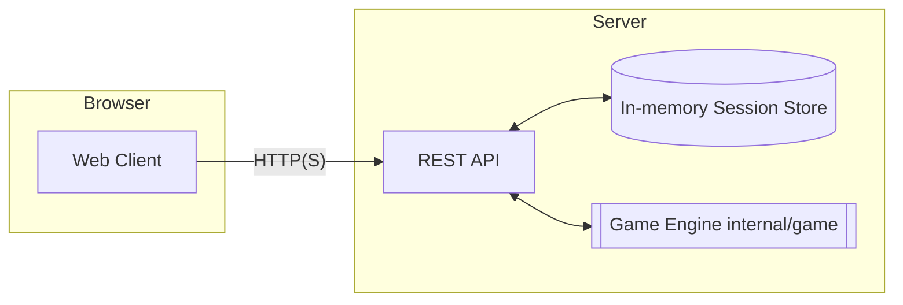
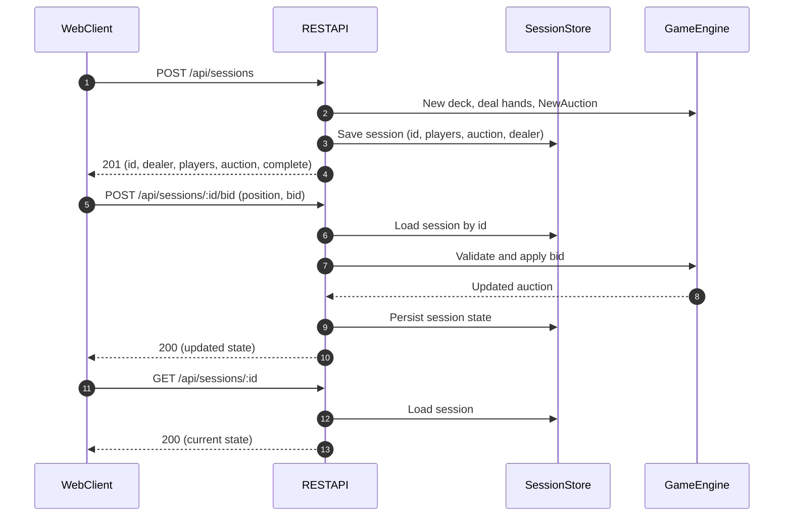

# Bridge Bidding Tutor in Go

A bridge bidding tutor with both a console-based simulator and a REST server with a simple web client. Practice and learn bidding conventions with AI partners and opponents.

## Features

- Interactive command-line interface for bidding.
- AI opponents using a simplified Polish Club system (Stayman, Jacoby transfers, strong 1♣ with continuations, Puppet/Gerber over 2NT, etc.).
- Hand evaluation (High Card Points and distribution).
- End-of-auction summary showing all four hands for review.
- REST service to create sessions, fetch state, and post bids.
- In-browser client to drive the REST API (served by the server).

## Prerequisites

- Go 1.21 or higher

## Installation

1. Clone the repository:
   ```bash
   git clone https://github.com/marekforys/bridge-bid-tutor-go.git
   cd bridge-bid-tutor-go
   ```

2. Install dependencies:
   ```bash
   go mod tidy
   ```

## Usage

### CLI (console game)

1. Build and run the console game:
   ```bash
   go run cmd/bridge/main.go
   ```

2. Follow the on-screen instructions to place your bids.

### REST server + Web client

1. Start the REST server (serves API and static web client):
   ```bash
   go run cmd/server/main.go
   ```

2. Open the web client in your browser:
   - http://localhost:8080/

3. Use the "New Session" button to deal and start an auction, then submit bids.

4. Alternatively, interact with the REST API directly with curl:
   - Create a new session
     ```bash
     curl -s -X POST http://localhost:8080/api/sessions | jq
     ```
   - Fetch a session
     ```bash
     curl -s http://localhost:8080/api/sessions/<SESSION_ID> | jq
     ```
   - Post a bid
     ```bash
     curl -s -X POST http://localhost:8080/api/sessions/<SESSION_ID>/bid \
       -H 'Content-Type: application/json' \
       -d '{"position":"North","bid":"1C"}' | jq
     ```

Notes:
- CORS is permissive for local development (Access-Control-Allow-Origin: *). Preflight OPTIONS is supported.
- Sessions are in-memory; they reset when the server restarts.

### API Overview

- POST `/api/sessions`
  - Description: Create a new session (shuffles and deals, initializes the auction)
  - Request: none
  - Response (200/201):
    ```json
    {
      "id": "<uuid>",
      "dealer": "North",
      "players": [
        {"position":"North","hcp":12,"spades":"A K ...","hearts":"...","diamonds":"...","clubs":"..."},
        {"position":"East", ...},
        {"position":"South", ...},
        {"position":"West", ...}
      ],
      "auction": [],
      "complete": false
    }
    ```

- GET `/api/sessions/{id}`
  - Description: Get the full session state
  - Response: same shape as above, with `auction` filled, e.g. `[{"position":"North","level":1,"strain":"C","pass":false,...}]`

- POST `/api/sessions/{id}/bid`
  - Description: Submit a bid for the current dealer
  - Request JSON:
    ```json
    { "position": "North|East|South|West", "bid": "1C|1H|1S|1NT|Pass|X|XX" }
    ```
  - Response: updated session state
  - Errors:
    - 400 if bid format or relative validity is wrong.
    - 409 if you submit a bid for a non-dealer (not your turn).

## How to Play

- You play as South (your hand will be displayed).
- The other three positions (North, East, West) are controlled by the computer.
- When it's your turn, enter your bid:
  - To bid: Enter the level followed by the suit (e.g., `1H`, `2NT`, `3C`).
  - To pass: Type `pass` or `p`.
  - To double: Type `double`, `dbl`, or `x`.
  - To redouble: Type `redouble`, `rdbl`, or `xx`.

## Bidding System: Polish Club

The AI uses the **Polish Club** system, a sophisticated and powerful bidding system. Here are the core principles of its implementation:

- **Artificial 1♣ Opening**: This is the cornerstone of the system. It shows one of two hand types:
  - **Weak**: 11-14 HCP with a balanced or semi-balanced hand, without a 5-card major.
  - **Strong**: 18+ HCP with any shape.
- **1♦ Negative Response**: The primary response to a `1♣` opening is `1♦`, which is artificial and shows a weak hand (typically 0-6 HCP).
- **5-Card Majors**: An opening bid of `1♥` or `1♠` guarantees a 5-card suit.
- **1NT Opening**: Shows a balanced hand with 15-17 HCP.
- **Conventions over 1NT**: The AI still uses **Stayman** and **Jacoby Transfers** in response to a `1NT` opening.

Additional conventions covered in code and tests include:
- Responder continuations after strong 1♣ sequences (e.g., 1♣–1♦–2NT with Puppet 3♣ and Gerber 4♣).
- Opener responses to Puppet/Gerber and responder follow-ups to place contract (3NT, 4M, 6M).

## End-of-Auction Review

At the end of each auction, the game displays all four hands, allowing you to review the bidding in the context of the full deal.

```
Auction complete!
Final contract: 1S
------------------------------

--- All Hands ---

North (HCP: 5)
  Spades:   J 3
  Hearts:   J 10 8 6 5
  Diamonds: J 8 4
  Clubs:    Q 9 8

East (HCP: 11)
  Spades:   A 9 2
  Hearts:   K 9 3
  Diamonds: 10 6
  Clubs:    K J 10 7 2

South (HCP: 11)
  Spades:   Q 4
  Hearts:   7 2
  Diamonds: K Q 5 3
  Clubs:    A 6 5 4 3

West (HCP: 13)
  Spades:   K 10 8 7 6 5
  Hearts:   A Q 4
  Diamonds: A 9 7 2
  Clubs:
```

## Development

- Run tests:
  ```bash
  go test -v ./...
  ```

- Build binaries:
  ```bash
  go build ./...
  ```

## Architecture

### Components



Endpoints served by REST API:
- /api/sessions (POST)
- /api/sessions/:id (GET)
- /api/sessions/:id/bid (POST)

### Typical Flow



## License

This project is licensed under the MIT License - see the [LICENSE](LICENSE) file for details.
